# The BLOG views / pages

## Home page:
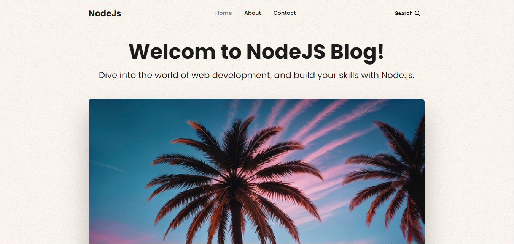

**List of the latest Posts (page 1)**
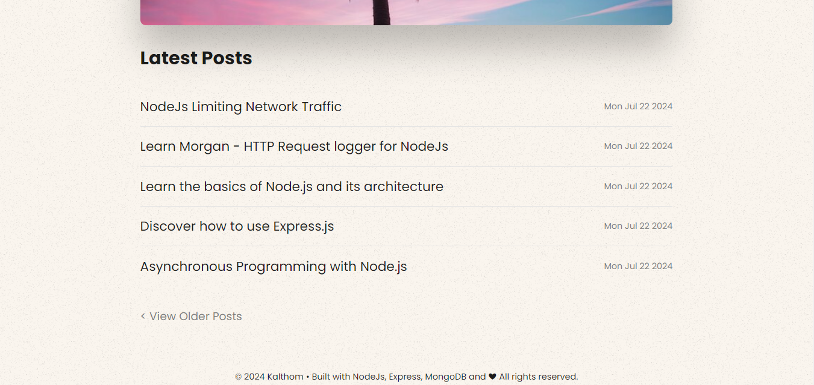

**List of the oldest Posts (page 2)**
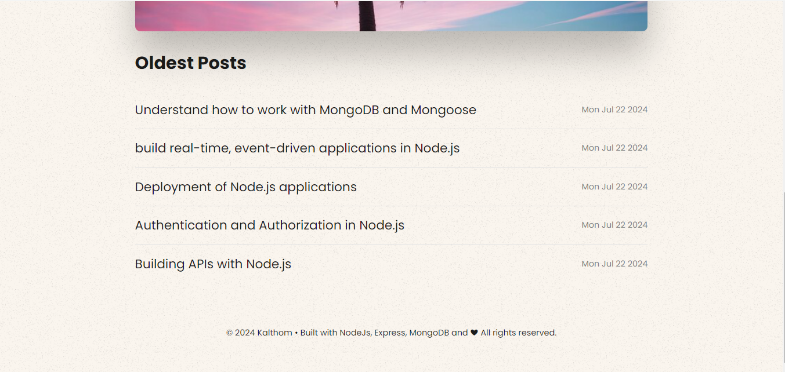

**View a specific article**
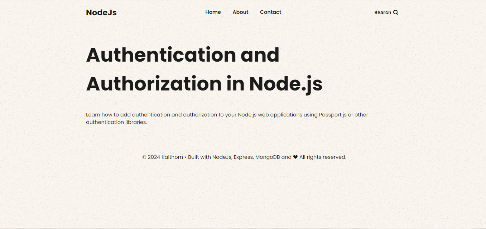

**Search for an article**
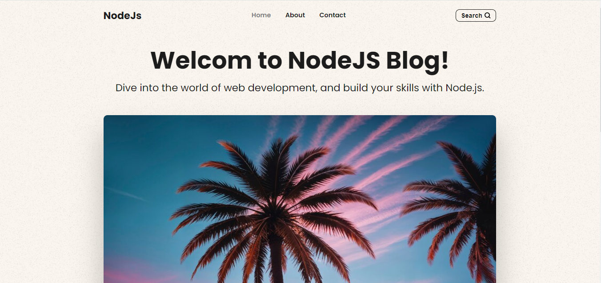

**Positive search match**
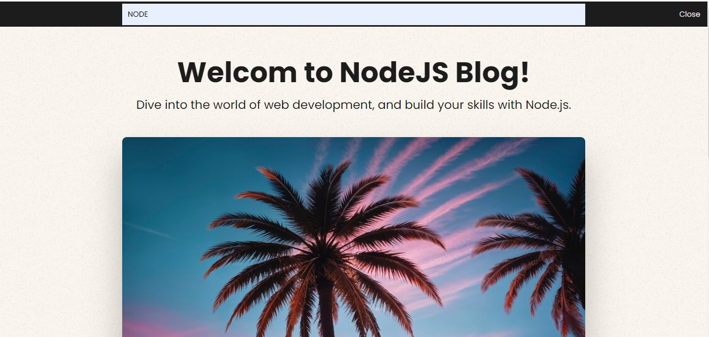

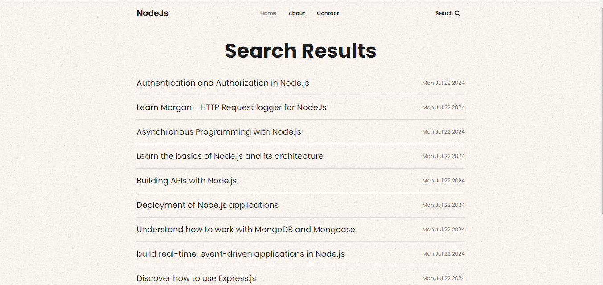

**Negative search match**

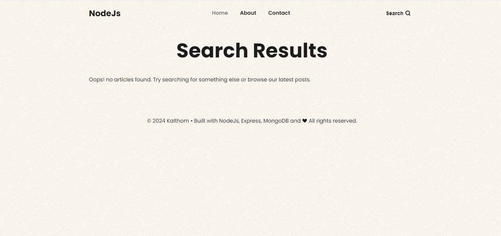

## About page:

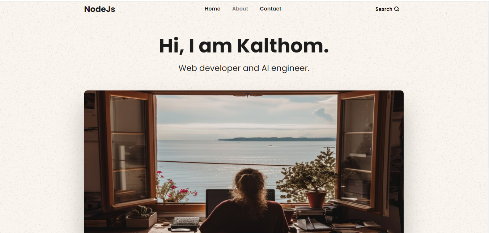

## Contact us page:
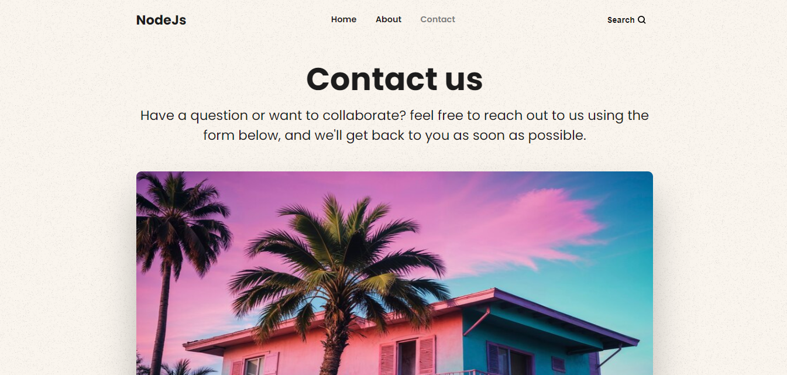
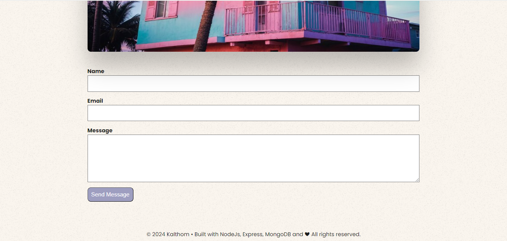

## Admin page:

**Admin Registration**

**Admin Login**

**Admin Dashboard**

## CRUD Operations by Admin:

**Make a new post**

**Update a post**

**Delete a post**

