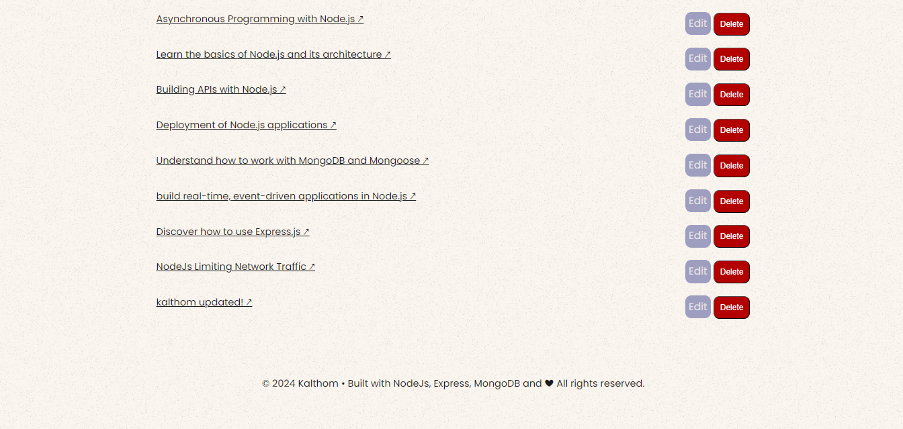

# The BLOG views / pages

## Home page:

**List of the latest Posts (page 1)**

**List of the oldest Posts (page 2)**

**View a specific article**

**Search for an article**

**Positive search match**

**Negative search match**

## About page:

## Contact us page:

## Admin page:

**Admin Registration**

**Admin Login**

**Admin Dashboard**

**View Contact Messages**

## CRUD Operations by Admin:

**Make a new post**

**Update a post**

**Delete a post**

# Routs and functionalties

The routes are organized into two categories: main/public routes and admin routes. 
The main/public routes handle the main functionality of the blog, such as displaying the home page, individual articles, search functionality, and the contact form. 
The admin routes handle the administrative functions, such as user registration and login, managing blog posts, and viewing contact messages. The admin routes are protected by an authMiddleware that checks for a valid JWT token in the user's cookie. 

# 1- Main/Public Routes (in [main.js](server/routes/main.js)):

* Home Page (/):

Renders the home view.
Displays the latest blog posts, with pagination.

* Article Page (/article/:id):

Renders the article view.
Displays the details of a specific blog post.

* Search (/search):

Renders the search view.
Handles the search functionality for blog posts.

* About Page (/about):

Renders the about view.

* Contact Page (/contact):

Renders the contact view.
Displays the contact form and handles the submission.
Saves the contact message in the database.
Redirects to the contact-success page.

* Contact Form Success Page (/contact-success):

Renders the contact-success view.

# 2- Admin Routes (in [admin.js](server/routes/admin.js)):

* Admin Registration Page (/register):

Renders the admin registration view.
Handles the registration of a new admin.
Hashes the password using bcrypt.
Saves the new user in the database.
Redirects to the login page.

* Admin Login Page (/login):

Renders the admin login view.
Handles the login of an admin user.
Checks the username and password.
Generates a JWT token and stores it in the user's cookie.
Redirects to the admin dashboard.

* Admin Dashboard (/dashboard):

Renders the admin dashboard view.
Requires authentication using the authMiddleware.
Displays the list of blog posts.

* Add New Post (/add-article):

Renders the admin add-article view.
Requires authentication using the authMiddleware.
Handles the creation of a new blog post.

* Edit Post (/edit-article/:id):

Renders the admin edit-article view with the post details.
Requires authentication using the authMiddleware.
Handles the update of an existing blog post.

* Delete Post (/delete-article/:id):

Requires authentication using the authMiddleware.
Handles the deletion of a blog post.

* View Contact Messages (/contact-messages):

Renders the admin/contact-messages view.
Requires authentication using the authMiddleware.
Displays the list of contact messages.

* Admin Logout (/logout):

Clears the user's JWT token from the cookie.
Redirects to the home page.

