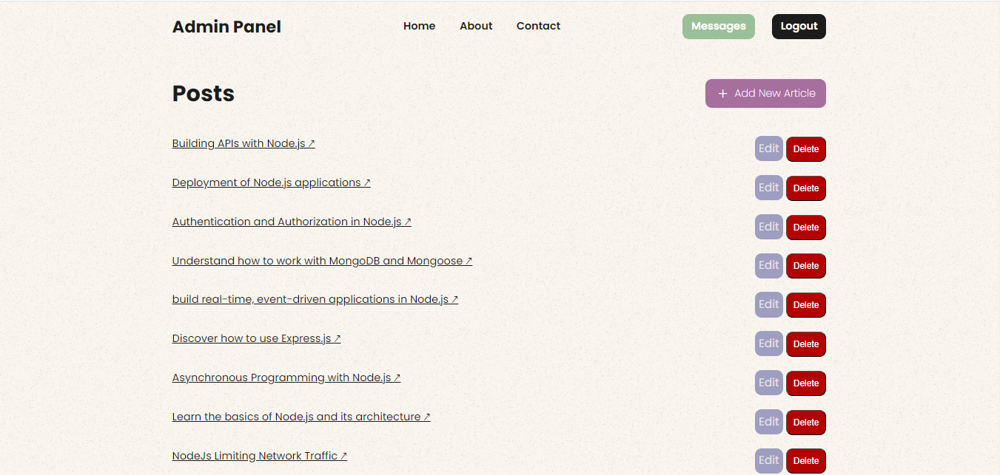

# NodeJS Blog App

## Overview

This blog application is a simple yet effective web-based platform built using Node.js, Express, and MongoDB. It allows users to read, search, and interact with blog posts, while providing an administrative interface for managing content. The application is powered by a robust backend system that ensures smooth operation and scalability, making it suitable for both individual and business use.


# Features & Functionalities

The blog app has a range of features that meet the needs of both content creators and readers:

## For Readers:

* Home Page: Displays the latest and oldest blog articles with pagination.

* Article Page: Allows users to read individual blog articles.

* Search Functionality: Allows users to quickly find relevant articles based on keywords in titles or content.

* About Page: Offers information about the author.

* Contact Form: Enables readers to reach out with questions, feedback, or inquiries.

## For Admins:

* Admin registration and login functionality: Securely creates and manages admin accounts for content management.

* Admin dashboard: Provides a centralized overview of published blog posts with easy access to management tools, enabling administrators to perform create, read, update, and delete (CRUD) operations over blog articles, as well as view contact messages.

* Create New Posts: Allows admins to draft and post new blog articles.

* Update Existing Posts: Enables admins to modify existing articles.

* Delete Posts: Grants admins the ability to remove blog articles.

* Contact Messages: Provides a platform for admins to view messages received through the contact form.


# The BLOG pages


## Home page:


**List of the latest Posts (page 1)**


**List of the oldest Posts (page 2)**


**View a specific article**


**Search for an article**


**Positive search match**


**Negative search match**


## About page:


## Contact us page:


## Admin page:

**Admin Registration**


**Admin Login**


**Admin Dashboard**



**View Contact Messages**


## CRUD Operations by Admin:

**Make a new post**


**Update a post**


**Delete a post**


# Routs

The routes are organized into two categories: main/public routes and admin routes. 
The main/public routes handle the main functionality of the blog, such as displaying the home page, individual articles, search functionality, and the contact form. 
The admin routes handle the administrative functions, such as user registration and login, managing blog posts, and viewing contact messages. The admin routes are protected by an authMiddleware that checks for a valid JWT token in the user's cookie. 

# 1- Main/Public Routes (in [main.js](server/routes/main.js)):

These routes are accessible to all users of the blog.

* **GET `/`** - Home Page: Displays a list of blog articles with pagination.

* **GET `/article/:id`** - Article page: Displays a specific article based on the given ID.

* **POST `/search`** - Search: Allows users to search for articles by title or content.

* **GET `/about`** - About Page: Provides information about the author.

* **GET `/contact`** - Contact Page: Displays a contact form for users to reach out.

* **POST `/contact`** - Contact form submission: Handles form submissions and saves messages to the database.

* **GET `/contact-success`** - Contact success Page: Displays a success message after a contact form is successfully submitted.


# 2- Admin Routes (in [admin.js](server/routes/admin.js)):

These routes require authentication and are used for managing the blog content.

* **GET `/register`** - Admin Registration Page: Displays the registration page for new admin users.

* **POST `/register`** - Admin Register: Handles registration form submissions and creates new admin users.

* **GET `/login`** - Admin Login Page: Displays the login page for admin users.

* **POST `/login`** - Admin Login: Authenticates admin users and starts a session.

* **GET `/dashboard`** - Admin Dashboard Page: Displays the dashboard with an overview of blog articles. (Protected route)

* **GET `/add-article`** - Create New Post Page: Displays the form to create a new blog post. (Protected route)

* **POST `/add-article`** - Create New Post: Handles the submission of new blog posts. (Protected route)

* **GET `/edit-article/:id`** - Update Post Page: Displays the form to edit an existing blog post based on ID. (Protected route)

* **PUT `/edit-article/:id`** - Update Post: Handles the submission of updates to existing blog posts. (Protected route)

* **DELETE `/delete-article/:id`** - Delete Post: Deletes a blog post based on the given ID. (Protected route)

* **GET `/contact-messages`** - View Contact Messages Page: Displays messages sent by users through the contact form. (Protected route)

* **GET `/logout`** - Admin Logout: Logs out the admin user and ends the session.


### Authentication Middleware

The application utilizes a custom authentication middleware (`authMiddleware`) to protect admin-only routes. This middleware verifies the presence of a JWT token in the request cookies. If a valid token is found, the user's ID is extracted and attached to the request object (`req.userId`) for subsequent use.

```
const authMiddleware = (req, res, next ) => {
  const token = req.cookies.token;

  if(!token) {
    return res.status(401).json( { message: 'Unauthorized'} );
  }

  try {
    const decoded = jwt.verify(token, jwtSecret);
    req.userId = decoded.userId;
    next();
  } catch(error) {
    res.status(401).json( { message: 'Unauthorized'} );
  }
}
```

# Models

**Article**: Represents a blog article with fields such as title, body.

**User**: Represents an admin user with fields such as username and password.

**Contact**: Represents a contact form message with fields such as name, email, and message.


# Technologies and Libraries Used:

The blog app is built using a combination of cutting-edge technologies and reliable libraries:

* **Node.js**: A powerful JavaScript runtime environment for building server-side applications (the backend system).
* **Express**: A robust web framework for Node.js, used for routing and middleware support.
* **MongoDB**: A NoSQL database for storing articles, users(admins), and contact messages.
* **Mongoose**: An Object Data Modeling (ODM) for MongoDB, used for database interactions.
* **EJS**: A templating engine for Node.js, enabling the creation of dynamic and reusable HTML views.
* **Express-layout**: A library for managing page layouts, allowing for consistent structure and design across the application.
* **Bcrypt**: A library for securely hashing passwords, protecting user credentials from unauthorized access.
* **Jsonwebtoken**: A library for generating and verifying JSON Web Tokens (JWTs), used for authentication and session management.
* **Express-session & Cookie-parser**: Middlewares for managing sessions and authentication.
* **connect-mongo**: A library for storing session data in MongoDB, ensuring persistence and scalability.
* **MongoStore**: A middleware that integrates MongoDB with Express-session, enabling the storage of session data in the database.
* **Method-override**: A middleware for supporting HTTP methods like PUT and DELETE, allowing for more flexible data manipulation.
* **Dotenv**: A library for loading environment variables from a `.env` file, keeping sensitive information like database credentials separate from the main codebase.
